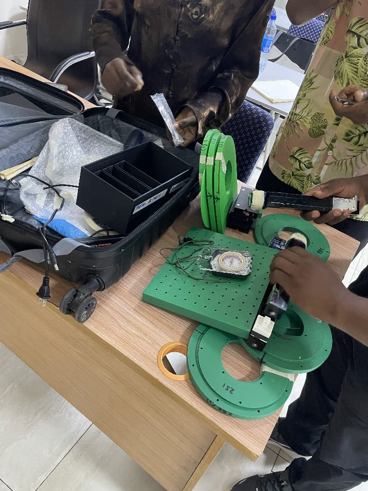

# Low-Field MRI Field Mapping Robot

## Overview

This project describes the construction of a low-field MRI field-mapping system that combines a permanent-magnet Halbach array with a three-axis robotic positioning platform.

The system was designed to automate magnetic field measurements inside the MRI imaging volume. A Hall probe connected to a gaussmeter was mounted on a robotic positioning system driven by three linear actuators. The robot moved the probe through predefined coordinates while Python scripts controlled motion and collected magnetic field measurements automatically.

The project integrates MRI hardware, embedded systems, robotics, automation, and data acquisition into a single experimental platform.

---

## System Components

### MRI System

- Halbach permanent magnet array
- 3D-printed magnet housing
- Imaging bore


### Robotic System

- Arduino UNO R4 Minima
- Three linear actuators
- Three stepper motors
- Three TB6600 (M422) motor drivers
- 24 V DC power supply

### Measurement System

- Hall probe
- AlphaLab GM2 gaussmeter

### Software

- Arduino IDE
- Python
- NumPy
- Matplotlib
- PySerial

---



## MRI Magnet Construction

The low-field MRI system was built using a Halbach array configuration to generate a magnetic field inside the imaging volume.

The construction process included:

1. Verifying the orientation of all permanent magnets.

2. Installing the magnets into the 3D-printed rings.

3. Assembling the rings into the complete Halbach array.

4. Securing the magnet structure inside the external housing.

5. Verifying the magnetic field using a gaussmeter.

---

### Halbach Array

Insert an image of the assembled magnet here.

```markdown

```

---

## Robotic Positioning System

The robotic positioning platform was designed to move the Hall probe along the X, Y, and Z axes.

Each axis consisted of:

- One stepper motor
- One linear actuator
- One TB6600 motor driver

The robotic platform automated the field-mapping process and improved measurement repeatability.

---

### Robot Assembly

Insert an image of the completed robot here.

```markdown

```

---

## Wiring Configuration

### Arduino Pin Mapping

| Axis | Step Pin | Direction Pin |
| --- | --- | --- |
| X | 5 | 4 |
| Y | 3 | 2 |
| Z | 7 | 6 |

---

### Stepper Driver Connections

#### X-axis Driver

```text
PUL+ → Arduino pin 5
PUL- → Arduino GND

DIR+ → Arduino pin 4
DIR- → Arduino GND
```

#### Y-axis Driver

```text
PUL+ → Arduino pin 3
PUL- → Arduino GND

DIR+ → Arduino pin 2
DIR- → Arduino GND
```

#### Z-axis Driver

```text
PUL+ → Arduino pin 7
PUL- → Arduino GND

DIR+ → Arduino pin 6
DIR- → Arduino GND
```

---

### Power Connections

```text
Motor drivers → 24 V DC power supply

Driver VCC → 24 V positive terminal

Driver GND → 24 V negative terminal
```

---

### Wiring Diagram

Insert a wiring diagram here.

```markdown

```

---

## Software Workflow

The experiment follows four steps.

### 1. Upload the Arduino Code

Upload `Arduino_script.ino` to the Arduino UNO R4 Minima.

The Arduino is responsible for:

- Receiving serial commands
- Controlling the stepper motors
- Moving the robot

---

### 2. Detect the Arduino Port

Run:

```bash
python Arduino_finder.py
```

This script automatically detects the Arduino and creates:

```text
arduino_port.txt
```

---

### 3. Generate the Robot Path

Run:

```bash
python Path_maker.py
```

Current parameters:

```python
RADIUS_MM = 30
STEP_MM = 25
```

The script generates:

```text
path.csv
```

which contains all measurement coordinates.

---

### 4. Run the Field-Mapping Experiment

Run:

```bash
python Arduino_runner.py
```

The script will:

- Initialize the Hall probe
- Load the coordinates
- Move the robot
- Record the magnetic field
- Save the measurements

---

## Path Generation

Example coordinates:

```text
x    y    z

0    0   -30

-29 -4   -5

-4  -29  -5

-4  -4   -5

-4   21  -5

21  -4   -5

-22  3   20

3   -22  20

3    3   20
```

---

### Robot Path Visualization

Insert the path visualization generated by `Path_maker.py`.

```markdown

```

---

## Data Collection

Magnetic field measurements are stored in:

```text
data.csv
```

Example output:

```text
x     y     z     reading

0     0    -30    456.10

-29  -4     -5    456.09

3     3     20    456.11
```

---

## Magnetic Field Units

The gaussmeter records magnetic field values in gauss (G).

Conversion formulas:

```text
1 T = 10,000 G

1 mT = 10 G

1 G = 0.0001 T
```

---

## Field Homogeneity

Field homogeneity was evaluated using the peak-to-peak homogeneity equation:

```text
Homogeneity (ppm) =
((Bmax - Bmin) / Bcenter) × 1,000,000
```

where:

```text
Bmax = Maximum magnetic field

Bmin = Minimum magnetic field

Bcenter = Magnetic field at the center of the imaging volume
```

---

## Future Work

- Increase the number of measurement points
- Improve field-map resolution
- Generate three-dimensional field visualizations
- Optimize the imaging volume
- Improve magnetic field homogeneity

---

## Project Structure

```text
Field_mapper_robot/

├── Arduino_script.ino

├── Arduino_finder.py

├── Arduino_runner.py

├── Path_maker.py

├── path.csv

├── data.csv

├── arduino_port.txt

├── README.md

└── images/
```